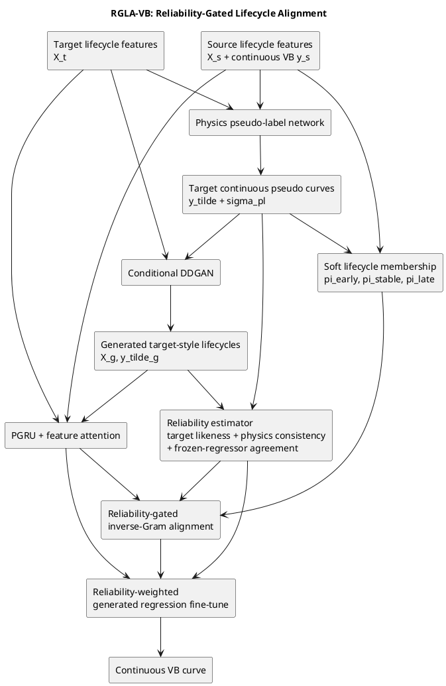
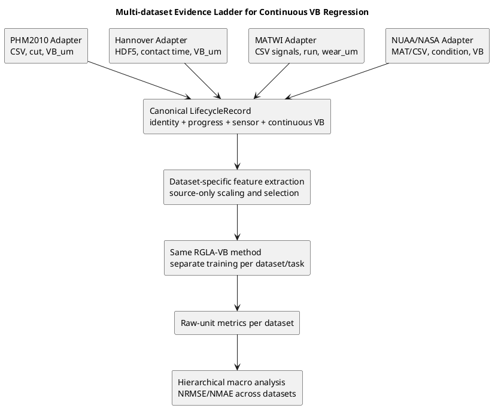

# 连续 VB 回归创新改进框架与实验计划

## Material Passport

- **Material ID**: `PHM-CONTINUOUS-VB-RGLA-PLAN-001`
- **Material Type**: Code Experiment Plan
- **Origin Skill**: `experiment-agent`
- **Origin Mode**: `plan`
- **Origin Date**: `2026-07-16`
- **Verification Status**: `UNVERIFIED`
- **Version Label**: `code_plan_v2`

> 本文由 `academic-research-suite` 的文献综合与实验设计流程生成。本次仅提出方法和实验计划，不修改训练代码、不下载数据、不启动实验。所有创新性判断与公开数据集判断均是截至 2026-07-16 的目标式查新结论，不等同于系统综述或“首次提出”证明。

**v2 更新**：新增权威公开数据集筛查、数据集适配层、多数据集证据梯度、跨数据集统计口径与成功标准。PHM2010 不再作为唯一证据来源。

## 1. 任务定义冻结

本文所有改进均保持当前任务不变：

- 输入仍为每个 cut 的多传感器统计特征序列；
- 输出仍为原始物理量纲下的连续后刀面磨损量 `VB`，不使用 `VB_norm`；
- 不把回归任务改成初期/稳定/快速磨损三分类；
- 训练和推理仍采用 `DDGAN + 物理伪标签 + PGRU/GRU + 域适应 + 微调` 主流程；
- UDA 协议中目标域真实 VB 完全不可见；
- 前缀协议中仅允许目标刀具前 30% 的真实 VB 进入最终微调，后 70% 只用于评价；
- 最终输出为每个 cut 的连续预测曲线，并以 MAE、RMSE、R2、高磨损 MAE、endpoint error、Pearson 和单调违例评价。

需要特别区分两种实验协议：

| 协议 | 可用于训练的信息 | 评价范围 | 论文中应使用的名称 |
|---|---|---|---|
| A. Full-lifecycle UDA | 源域完整特征和真实 VB；目标域完整特征但无真实 VB | 目标域完整生命周期 | 无监督跨域连续 VB 回归 |
| B. Prefix-30 SSDA | 协议 A 的信息，加目标域前 30% 真实 VB | 目标域后 70% | 目标前缀辅助的半监督迁移回归 |

两种协议必须分表报告，不能把使用前 30% 目标标签的结果称为纯 UDA。

## 2. 现有实现与瓶颈

当前 `scripts/phm_paper_regression_pipeline.py` 已实现：

1. 从源域真实 VB 学习物理磨损曲线参数，并生成目标域连续伪标签；
2. 以目标伪磨损曲线为条件生成全生命周期目标风格特征；
3. 使用“物理网络重建曲线与生成条件的 MAE”硬筛选生成样本；
4. 在 PGRU 前进行轻量特征注意力；
5. 以 DANN 进行全局域对抗，再用生成目标样本微调回归头；
6. 可选使用目标前 30% 真实 VB 对回归头或第二层 PGRU 做最终微调。

代码核对还发现两个容易误述的事实：

- 当前连续回归脚本中的 `LifecycleDiscriminator` 是**单输出的目标相似度判别器**，不是已经实现的 Real/Domain/Wear 三头判别器；
- 当前生成样本一致性分数只用于硬保留/丢弃，进入微调后所有保留样本仍然等权。

当前主要瓶颈是：

- 全局 DANN 只要求源/目标不可区分，可能把不同 VB 水平的样本强行混合，破坏连续回归映射；
- 物理一致性刚好过阈值的生成样本与高一致性样本获得相同训练权重；
- 目标伪标签的不同 cut、不同生命周期阶段具有不同可靠性，但当前目标伪标签蒸馏和域对齐没有利用这种差异；
- 平滑二阶差分不等于磨损不可逆约束，因此高磨损段和端点仍可能出现系统偏差。

## 3. 文献边界与创新空间

### 3.1 已有工作已经覆盖的单点

以下模块本身不宜单独宣称为主要创新：

| 单点 | 已有代表工作 | 对本项目的含义 |
|---|---|---|
| DDGAN + 物理伪标签 + PGRU | [Liu et al., 2025](https://doi.org/10.1016/j.jmsy.2025.04.002) | 可保留其流程，但原工作以三阶段分类为主，不能直接支持连续 VB 结论 |
| 连续磨损对抗域适应 | [Zhu et al., 2022](https://doi.org/10.1016/j.measurement.2022.111644)、[Hou et al., 2022](https://doi.org/10.1016/j.jmapro.2022.11.017) | DANN/双回归器不是新模块，且全局对齐可能负迁移 |
| 轻量通道注意力 + GRU | [Cheng et al., 2025](https://doi.org/10.1177/14759217241240663) | 注意力适合作为低成本组件和消融项，不足以单独构成主创新 |
| 回归专用逆 Gram 对齐 | [DARE-GRAM, CVPR 2023](https://openaccess.thecvf.com/content/CVPR2023/html/Nejjar_DARE-GRAM_Unsupervised_Domain_Adaptation_Regression_by_Aligning_Inverse_Gram_Matrices_CVPR_2023_paper.html)、[Liu et al., 2026](https://doi.org/10.1016/j.jmapro.2026.06.015) | 用 DARE-GRAM 替换 DANN 是强基线，但不是本项目原创 |
| 不确定性指导回归域对齐 | [Nejjar et al., 2026](https://doi.org/10.1016/j.ress.2025.112143) | 单纯“用不确定性给对齐加权”已有 UGA，不能作为唯一创新 |
| 物理不确定性筛选伪标签 | [PGS-CoReg, 2026](https://www.sciencedirect.com/science/article/pii/S0888327026007405) | 单纯“物理 + 不确定性门控伪标签”已有直接近邻工作 |
| 连续磨损单调坐标迁移 | [MPMST, 2026](https://doi.org/10.3390/s26123873) | 单调分数、分位数传输和 isotonic 回归已有工作，不能照搬为新方法 |
| MC Dropout 磨损不确定性 | [Dey et al., 2023](https://doi.org/10.3390/computers12090187) | MC Dropout 可作可靠性基线，但不是创新主体 |

### 3.2 可辩护的组合创新候选

建议主方法定位为：

> **RGLA-VB：Reliability-Gated Lifecycle Alignment for Continuous VB Regression，可靠性门控的连续生命周期回归对齐。**

它不声称发明注意力、DARE-GRAM或不确定性估计，而是针对当前 DDGAN 回归流程建立一条新的闭环：

1. 由“目标相似度、物理曲线一致性、冻结回归器一致性”共同估计生成样本和目标伪标签的连续可靠性；
2. 同一可靠性既控制生成样本的回归贡献，也控制目标样本进入域对齐的强度；
3. 使用连续伪 VB 构造软生命周期成员度，在每个生命周期区域内做回归几何对齐；
4. 全程保留连续 VB，不生成硬磨损类别，也不使用目标后缀真实标签。

与近邻方法的实质区别是：

- 相比 DARE-GRAM：不是全局等权对齐，而是由 DDGAN/物理伪标签可靠性控制的软生命周期条件对齐；
- 相比 UGA：可靠性来自物理条件生成闭环与双模型一致性，而不是仅用通用 evidential uncertainty；
- 相比 PGS-CoReg：可靠性不仅筛选伪标签，还共同控制生成样本回归和跨域回归几何对齐；
- 相比 MPMST：不把多维特征压缩成单调一维分数，也不使用 isotonic 回归替换 PGRU，而是在深层连续表征中保护局部磨损结构；
- 相比原 DDGAN-PGRU：从“生成后硬筛选、全局 DANN、等权微调”变为“连续可信度、局部回归对齐、加权微调”。

因此，RGLA-VB 的创新性来自**可靠性、生成增强和连续生命周期条件回归对齐的耦合机制**。正式论文应使用“提出一种组合框架”或“面向该流程设计”，暂不使用“首次”表述。

## 4. 改进点优先级

| 优先级 | 改进点 | 创新潜力 | 实现成本 | 是否作为主张 | 主要解决的问题 |
|---:|---|---|---|---|---|
| 1 | RGLA-VB 完整框架 | 中高 | 中等，约 1-2 天实现与自检 | 主创新候选 | DANN 负迁移、伪标签噪声、生命周期错配 |
| 2 | 连续生成可靠性加权 | 中等 | 低，约 0.5 天 | 核心组件 | 硬阈值后等权导致局部污染 |
| 3 | 可靠性门控软生命周期逆 Gram 对齐 | 中高 | 中等，约 1 天 | 核心组件 | 全局对齐破坏连续 VB 映射 |
| 4 | 高磨损加权的弱单调损失 | 中低 | 低，约 1-2 小时 | 辅助组件 | endpoint、高磨损 MAE、单调违例 |
| 5 | 现有轻量特征注意力 | 低 | 已实现 | 固定骨干/消融项 | 特征通道冗余和小样本噪声 |

建议先完成第 2 和第 3 项的独立消融，再合并为 RGLA-VB；单调损失只有在完整框架仍存在明显端点误差时再加入。注意力保持现有实现，不在第一轮改变位置或结构。

## 5. RGLA-VB 方法框架

### 5.1 总体流程图



### 5.2 连续可靠性估计

对第 `j` 个生成生命周期集合，保留当前物理一致性误差：

```math
e_j^{phy}=\frac{1}{T s_y}\sum_{t=1}^{T}
\left|P(x_{j,t}^{g})-\tilde y_{j,t}^{g}\right|,
```

其中 `P` 是冻结的物理伪标签网络，`s_y=Q_{0.95}(y_s)-Q_{0.05}(y_s)` 用于消除 VB 量纲影响。

再加入冻结源回归器 `f_0` 与生成条件的分歧：

```math
e_j^{reg}=\frac{1}{T s_y}\sum_{t=1}^{T}
\left|f_0(x_{j,t}^{g})-\tilde y_{j,t}^{g}\right|.
```

当前单输出判别器可提供目标相似度：

```math
c_j^{tgt}=\sigma(D(x_j^g)).
```

首版不改成复杂三头判别器，生成可靠性定义为：

```math
r_j^g=\operatorname{clip}\left[
c_j^{tgt}\exp\left(-\frac{e_j^{phy}}{\tau_{phy}}\right)
\exp\left(-\frac{e_j^{reg}}{\tau_{reg}}\right),
r_{min},1
\right].
```

这比现有硬阈值多保留了样本质量的连续差异。硬筛选仍可作为安全下限，但通过筛选后的样本不再等权。

对真实目标样本的第 `t` 个 cut，使用目标伪标签在不同生命周期窗口上的标准差和冻结回归器分歧构造可靠性：

```math
r_t^t=\operatorname{clip}\left[
\exp\left(-\frac{|f_0(x_t^t)-\tilde y_t^t|}{\tau_d s_y}\right)
\exp\left(-\frac{\sigma_{pl,t}}{\tau_u s_y}\right),
r_{min},1
\right].
```

所有可靠性在训练使用前执行 `detach()`，不得通过最小化对齐损失人为把可靠性抬高。

### 5.3 软生命周期成员度

不把 VB 离散为类别，而是在连续轴上定义 `K=3` 个重叠基函数。生命周期中心 `mu_k` 和尺度 `h` 只从源域真实 VB 的稳健分位数确定并冻结：

```math
\pi_{t,k}(y)=
\frac{\exp[-((y-\mu_k)/(h s_y))^2]}
{\sum_{q=1}^{K}\exp[-((y-\mu_q)/(h s_y))^2]}.
```

- 源域使用真实 `y_s` 计算 `pi_s`；
- UDA 目标域使用 `y_tilde` 计算 `pi_t`；
- Prefix-30 协议仅在前 30% 可使用真实目标 VB，后 70% 仍只能使用伪 VB；
- `pi` 是连续权重，不产生 early/stable/late 分类输出。

### 5.4 可靠性门控的回归几何对齐

PGRU 第二层输出 `H in R^(B x T x 240)`。先加入只服务于域对齐的 32 维投影头 `z=Proj(H)`，降低逆矩阵成本和小样本病态性。对域 `d` 和软阶段 `k`：

```math
G_{d,k}=\frac{Z_d^T W_{d,k} Z_d}
{\operatorname{tr}(W_{d,k})+\epsilon}+\eta I,
```

其中：

```math
W_{s,k}=\operatorname{diag}(\pi_k(y_s)),
\qquad
W_{t,k}=\operatorname{diag}(r^t\pi_k(\tilde y_t)).
```

计算正则化伪逆 `A_{d,k}=pinv(G_{d,k})`，按 DARE-GRAM 的角度和尺度思想对齐：

```math
L_{angle,k}=1-\frac{\langle A_{s,k},A_{t,k}\rangle_F}
{\|A_{s,k}\|_F\|A_{t,k}\|_F+\epsilon},
```

```math
L_{scale,k}=\left|\log\frac{\|A_{s,k}\|_F+\epsilon}
{\|A_{t,k}\|_F+\epsilon}\right|.
```

```math
L_{RGLA}=\sum_{k=1}^{K}\gamma_k
(L_{angle,k}+\beta L_{scale,k}).
```

`gamma_k` 由源/目标在该软阶段的有效支持量共同确定；有效样本不足时跳过该阶段，避免早期 batch 中的病态逆矩阵。正式实现时应对照 DARE-GRAM 官方实现核对低秩截断和角度/尺度公式。

### 5.5 加权生成微调与总损失

生成样本损失改为：

```math
L_{gen}^{r}=\frac{\sum_j r_j^g
\operatorname{SmoothL1}(f(x_j^g),\tilde y_j^g)}
{\sum_j r_j^g+\epsilon}.
```

域适应阶段：

```math
L_{adapt}=L_{src-reg}+\lambda_{prefix}L_{prefix}
+\lambda_{align}L_{RGLA}+\lambda_{smooth}L_{smooth}.
```

生成微调阶段：

```math
L_{ft}=L_{gen}^{r}+\lambda_{replay}L_{source-replay}
+\lambda_{pl}L_{target-pseudo}^{r}+\lambda_{prefix}L_{prefix}.
```

目标伪标签项 `L_target-pseudo^r` 使用逐 cut 的 `r_t^t` 加权。若其消融无收益，首版论文可以只保留生成样本加权，不强行叠加所有项。

## 6. 推荐默认参数

首轮只允许少量预注册参数，避免用目标测试集调参：

| 参数 | 首选值 | 备选敏感性值 | 说明 |
|---|---:|---|---|
| 对齐投影维度 | 32 | 16、64 | 兼顾稳定性和表达能力 |
| 软阶段数 `K` | 3 | 1、5 | `K=1` 等价于无生命周期条件 |
| 软阶段宽度 `h` | 0.20 | 0.15、0.25 | 相对源 VB 稳健范围 |
| `tau_phy` | 0.10 | 0.05、0.20 | 物理一致性温度 |
| `tau_reg` / `tau_d` | 0.15 | 0.10、0.25 | 冻结回归器一致性温度 |
| `tau_u` | 0.10 | 0.05、0.20 | 伪标签窗口方差温度 |
| `r_min` | 0.05 | 0.10 | 防止有效样本完全消失 |
| Gram shrinkage `eta` | `1e-3` | `1e-4`、`1e-2` | 防止病态矩阵 |
| 低秩维数 | 12 | 8、16 | 参考 DARE-GRAM 思路 |
| `lambda_align` | 0.05 | 0.01、0.10 | 先弱对齐，避免压过源回归损失 |
| `beta` | 1.0 | 0.5 | 角度与尺度相对权重 |

参数只能通过源域留出验证、目标前缀内部验证或预先指定的开发迁移方向选择。不得根据 C4/C6 后 70% 指标挑选参数。

## 7. 实现接口设计

计划新增参数，默认值必须保持旧命令行为不变：

```text
--alignment-mode dann|dare_gram|rgla
--alignment-projection-dim 32
--soft-stage-count 3
--soft-stage-width 0.20
--gram-shrinkage 1e-3
--gram-rank 12
--generated-weighting none|physics_dual
--reliability-tau-physics 0.10
--reliability-tau-regressor 0.15
--reliability-tau-uncertainty 0.10
--reliability-min 0.05
--lambda-alignment 0.05
```

建议新增模块：

| 模块 | 位置 | 预计改动 |
|---|---|---:|
| `compute_generated_reliability` | 生成样本筛选后 | 50-80 行 |
| `compute_target_cut_reliability` | 伪标签输出后、适应前 | 40-60 行 |
| `SoftLifecycleMembership` | PGRU/损失模块附近 | 30-50 行 |
| `ReliabilityGatedGramLoss` | 域适应损失模块 | 80-130 行 |
| 加权 SmoothL1 | `fine_tune_regression_head` | 20-40 行 |
| 诊断输出与测试 | 写出/恢复/配置兼容模块 | 80-120 行 |

预期总改动约 300-480 行，主要集中在一个训练脚本中，不更改数据格式和最终预测 CSV 接口。

建议输出：

- `{source}_to_{target}_generated_reliability.csv`
- `{source}_to_{target}_target_cut_reliability.csv`
- `{source}_to_{target}_soft_stage_membership.csv`
- `alignment_diagnostics.json`
- `reliability_diagnostics.json`
- 原有 `cut,y_true,y_pred` 预测 CSV 保持不变
- 多 seed 汇总继续输出均值、样本标准差和逐 seed 指标

可靠性诊断至少包括均值、分位数、上下界占比、有效样本量：

```math
ESS=\frac{(\sum_i r_i)^2}{\sum_i r_i^2}.
```

## 8. 实验问题与假设

### RQ1：当前负迁移是否来自全局域对齐破坏连续回归几何？

- **H1**：DARE-GRAM 相比 DANN 降低目标 RMSE，且源域回归误差不明显上升。
- 关键对照：Source-only、DANN、DARE-GRAM；其余训练预算完全一致。

### RQ2：连续可靠性是否优于现有硬筛选后等权训练？

- **H2**：可靠性加权降低生成微调后的 MAE/RMSE及 seed 方差。
- 机制证据：`r_g` 与离线生成一致性误差负相关，且 ESS 不塌缩。

### RQ3：软生命周期条件是否能避免不同 VB 水平错配？

- **H3**：软阶段 RGLA 相比全局 DARE-GRAM 主要改善高磨损 MAE 和 endpoint error，而不是只改善总体域可分性。
- 机制证据：高磨损软阶段的对齐损失下降，同时目标伪标签顺序不被破坏。

### RQ4：完整框架是否稳定优于当前 DDGAN-PGRU？

- **H4**：RGLA-VB 在双向 C4/C6 迁移的多 seed 平均 RMSE 上优于当前方法，且没有以更差的端点和单调性换取总体误差下降。

### RQ5：收益能否跨数据集、机床、刀具和传感器配置复现？

- **H5**：冻结结构与主要超参数后，RGLA-VB 在 PHM2010 之外至少两个公开数据集上仍优于当前 B2，并在跨机床主验证集上保持同方向收益。
- 该假设检验的是方法可迁移性，不要求不同数据集共享同一个模型权重或完全相同的输入通道。

## 9. 对照与消融矩阵

主实验固定使用原始 `VB`、相同特征、相同 PGRU、相同特征注意力、相同训练轮数和配对 seed。

| ID | DDGAN/伪标签 | 对齐 | 生成样本使用 | 软生命周期 | 目的 |
|---|---|---|---|---|---|
| B0 | 无 | 无 | 无 | 无 | Source-only 下界 |
| B1 | 无 | DANN | 无 | 无 | 复现当前负迁移基线 |
| B2 | 有 | DANN | 硬筛选后等权 | 无 | 当前 proposed 基线 |
| B3 | 有 | DARE-GRAM | 硬筛选后等权 | 无 | 回归专用对齐强基线 |
| A1 | 有 | DANN | 可靠性加权 | 无 | 只验证生成可靠性 |
| A2 | 有 | 全局可靠性门控 DARE-GRAM | 等权 | `K=1` | 只验证可靠性门控对齐 |
| A3 | 有 | 软阶段 DARE-GRAM | 等权 | `K=3`，无可靠性 | 只验证生命周期条件 |
| M | 有 | RGLA | 可靠性加权 | `K=3` | 完整 RGLA-VB |
| M-Mono | 有 | RGLA | 可靠性加权 | `K=3` | 可选加入弱单调损失 |

注意力/PGRU 归因另做小型二维消融，不与主方法搜索混在一起：

| 骨干 | 无注意力 | 有特征注意力 |
|---|---|---|
| 标准 GRU | G0 | G1 |
| PGRU | P0 | P1 |

若 PGRU 或注意力没有跨 seed 稳定收益，论文应如实把它们降级为实现选择，不把完整方法收益归因给它们。

## 10. 分阶段实验设计

### Phase 0：协议和数值自检

- 仅运行 30-cut、单 seed smoke test；
- 检查旧命令在默认 `alignment_mode=dann`、`generated_weighting=none` 时结果可复现；
- 检查 `pinv`、SVD、梯度和 checkpoint 恢复无 NaN；
- 检查 `r_g`、`r_t`、`pi` 范围与和约束；
- smoke 指标只用于发现错误，不用于选择方法。

### Phase 1：机制筛查

- 运行 C1->C4 full-lifecycle，使用固定 seed `20260510`；
- 比较 B0、B1、B2、B3、A1、A2、A3、M；
- 只淘汰发生数值崩溃、ESS 低于 20%、或源域回归误差恶化超过 10% 的配置；
- 不按 C4 测试指标挑最佳超参数。

### Phase 2：主验证

主要迁移方向：

1. `C4 -> C6`，full-lifecycle UDA；
2. `C6 -> C4`，full-lifecycle UDA；
3. `C4 100% + C6 前30% -> C6 后70%`；
4. `C6 100% + C4 前30% -> C4 后70%`。

确认性方法：B0、B1、B2、B3、A1、A3、M。M-Mono 只有在预注册条件触发后进入下一阶段。

配对 seeds：

```text
20260510, 20260511, 20260512, 20260513, 20260514
```

每个方法必须使用同一 seed 的相同数据增强、初始化和训练预算。禁止从多个 seed 中挑“比较好的”作为论文主结果。

### Phase 3：独立多数据集验证

若 Phase 2 支持 H4，冻结 RGLA-VB 结构、损失形式和主要超参数，按第 18 节的数据集证据梯度执行：

1. Hannover 多机床数据作为**独立主验证**，执行 3 台机床间全部 6 个有向 UDA 任务；
2. MATWI 作为**跨刀具、变参数外部验证**，执行工具分组的 5 折 UDA；
3. NUAA Ideahouse 和 NASA Milling 作为**跨工况/跨材料辅助验证**；
4. Nonastreda、Vicomtech 或 ExtraDrey 只作为资源允许时的稳健性扩展。

外部数据集不得根据目标测试标签重新搜索完整超参数。只允许调整数据读取、单位转换、输入维度和由源域验证决定的数值稳定参数。

### Phase 4：PHM2010 方向扩展

将 Phase 2 的固定配置扩展到 `C1 -> C4`、`C1 -> C6` 及反向迁移，用于检验方法是否只对 C4/C6 特定组合有效。此阶段不再调整超参数。

## 11. 指标与统计分析

### 11.1 主要和次要终点

- **主要终点**：目标评价区间的 RMSE，单位为 `um`；
- **关键次要终点**：MAE、高磨损 MAE、endpoint error；
- **支持性终点**：R2、Pearson、单调违例；
- **机制指标**：可靠性 ESS、`Spearman(r_g, -e_phy)`、各软阶段有效支持量、角度/尺度对齐损失、训练时长和显存。
- **跨数据集汇总指标**：`NRMSE = RMSE / (Q95(y_t)-Q05(y_t))` 与对应 NMAE。它们仅用于跨数据集汇总，模型输出和各数据集主表仍使用原始连续 VB 单位。

高磨损区阈值必须在实验前固定，建议沿用当前评价脚本定义；不得根据结果移动阈值。

### 11.2 汇总方法

- 每个方向报告五个 seed 的逐 seed 值、均值、样本标准差和 95% bootstrap CI；
- 对同一方向和 seed 计算 `M - B2` 的配对误差差值；
- 以“方向 x seed”为配对单元报告中位差和配对 bootstrap CI；
- 样本量较小时不以单个 `p < 0.05` 作为成功依据，优先看效应大小、方向一致性和置信区间；
- 多个消融比较如需显著性检验，使用 Holm 校正。
- 多数据集总效应使用“数据集 -> 迁移任务 -> seed”的分层 bootstrap，先对每个目标工具/目标域做宏平均，禁止让 6418 个样本的 Hannover 数据自动压过小数据集。

## 12. 成功标准与停止规则

完整 RGLA-VB 进入论文主方法的最低标准：

1. 相比当前 B2，在 C4->C6 与 C6->C4 合并的平均 RMSE 至少降低 5%；
2. 任一主要方向的平均 RMSE 不得恶化超过 2%；
3. 至少 7/10 个“方向 x seed”配对单元优于 B2；
4. 高磨损 MAE 或 endpoint error 至少一个改善，另一个不得恶化超过 3%；
5. 可靠性 ESS 不低于候选样本数的 30%，且权重未大面积卡在上下界；
6. 训练过程中无 NaN，旧命令保持兼容，预测导出仍为 `cut,y_true,y_pred`。
7. 在独立 Hannover 多机床数据上，6 个方向的宏平均 NRMSE 相比 B2 至少降低 5%，且至少 4/6 个方向改善；
8. 在 MATWI、NUAA、NASA 中至少两个可执行外部数据集上取得同方向的宏平均改善；
9. 全部公开数据集合并后，至少 60% 的“数据集 x 迁移任务 x seed”配对单元优于 B2，且任一数据集宏平均 NRMSE 不恶化超过 3%。

决策规则：

- 若 B3 优于 B2，而 M 不优于 B3：采用 DARE-GRAM 作为工程改进，放弃 RGLA 主创新主张；
- 若 A1 有效但 A3 无效：保留连续生成可靠性加权，删除软阶段对齐；
- 若 A3 有效但 A1 无效：保留软生命周期回归对齐，不强调生成置信度；
- 若 M 只降低总体误差但加重端点误差：再测试 M-Mono，不立即扩大模型；
- 若所有适应方法均不如 B0：结论应转为“该刀具对存在条件映射偏移，当前无监督对齐导致负迁移”，而不是继续挑 seed。
- 若只在 PHM2010 有效、外部数据集无效：论文主张必须收缩为 PHM2010 特定流程改进，不能宣称一般化跨域刀具磨损方法。
- 若 Hannover 有效但 MATWI/NASA 无效：保留“跨机床迁移”主张，删除“跨材料/跨传感器普适性”主张。

## 13. 标签泄漏防护

以下规则必须通过代码断言和输出报告验证：

1. `wear_target` 固定为 `vb`，源域统计量只能由源域真实 VB 计算；
2. UDA 中目标真实 VB 只在全部训练和 checkpoint 选择完成后载入评价函数；
3. Prefix-30 中目标后 70% 真实 VB 不得参与标准化、伪标签、软阶段中心、early stopping、超参数选择或 seed 选择；
4. 软阶段中心只由源域 VB 或目标前缀训练子集计算，不能由目标完整真实曲线计算；
5. `r_t` 只能使用目标特征、物理伪标签、伪标签窗口方差和冻结模型预测；
6. 目标后缀指标不得用于选择 epoch。checkpoint 分数只能来自源训练/验证损失和允许的目标前缀内部验证；
7. 所有方法使用相同 cut 范围和相同后缀起点，不能因方法不同改变评价样本；
8. 报告中明确区分“每个待预测 cut 已有传感器信号的磨损估计”与“没有未来传感器信号的多步预测”。当前双向 PGRU 只适用于前者。
9. 数据划分必须按 `tool_id`、`machine_id` 或完整实验 case 分组；同一工具相邻 run、同一原始信号切出的窗口不得跨训练/验证/测试集。
10. 数据集提供者插值得到的 VB 必须标记为 `label_origin=interpolated`；不得把它与显微镜实测 VB 混称为同等精度标签。
11. 多数据集实验独立训练和评价，禁止先在外部目标真实 VB 上调参，再把该数据集称为独立验证。

## 14. 风险与缓解

| 风险 | 表现 | 缓解方案 |
|---|---|---|
| 可靠性与真实误差不相关 | 高权重样本反而误差大 | 先做离线相关性和分位覆盖诊断；保留 A1 消融 |
| 权重塌缩 | ESS 很低，只有少数样本训练 | batch/全局均值归一化、`r_min`、ESS 预警 |
| 伪阶段边界错位 | 后期目标样本被分配到早期 | 使用重叠软成员度，不用硬边界；报告成员度曲线 |
| Gram 矩阵病态 | `pinv` 梯度爆炸或 NaN | 32 维投影、shrinkage、低秩截断、最小支持量、梯度裁剪 |
| 计算量过大 | 每步多次 SVD 训练缓慢 | 低维投影；每 `n` 步计算一次；先全局 `K=1` smoke |
| 组件过多无法归因 | 完整方法有效但原因不清 | 严格执行 A1/A2/A3 消融，注意力固定不变 |
| 近期文献重叠 | 新工作已提出相似组合 | 投稿前再次查新；主张限定为当前生成-适应-微调框架 |
| 数据集身份捷径 | 模型靠采样率、通道数识别数据集 | 各数据集独立训练；不直接拼接原始数据；只在公共特征协议下做可选跨数据集迁移 |
| 标签测量口径不同 | `VB`、`VBmax`、平均刃口 VB 混用 | 数据集内保留原定义；跨数据集只汇总无量纲误差，不直接合并原始 VB |
| 生命周期坐标不同 | cut、run、接触时间无法直接对应 | 通过数据适配器输出 `progress_value` 和 `progress_type`；优先使用累计接触时间/材料去除量 |
| 外部数据过大 | MATWI/Hannover 下载和特征提取成本高 | 先下载元数据和单工具子集验证读取器，再按预注册工具组分批处理 |

## 15. 后续候选，不进入第一轮

### 15.1 高磨损加权的弱单调损失

只惩罚超过容忍带的反向变化，避免把真实测量噪声全部压平：

```math
L_{mono}=\frac{1}{T-1}\sum_t \omega_t
\operatorname{ReLU}(m-(\hat y_{t+1}-\hat y_t)).
```

`m` 首版取 0，`omega_t` 随源域连续 VB 软阶段平滑增大。它只能作为 endpoint/high-wear 补丁，不能替代回归对齐。

### 15.2 注意力池化

现有注意力位于 PGRU 前，作用是特征维重标定。后续可测试 PGRU 后的单头时间注意力池化，但必须保持逐 cut 输出，不能把整条生命周期压成单一标量；建议采用残差门控 `H'=H*(1+alpha)` 而非替换原特征。

### 15.3 三头判别器

若现有单输出判别器的目标相似度与生成质量相关性很弱，再升级为 Real/Domain/Continuous-Wear 三头。Wear Head 只作为生成质量估计器，不是最终 VB 输出；最终结果仍来自 PGRU 回归头。因为三头改造会改变 GAN 训练目标和 checkpoint 兼容性，所以不放入 RGLA-VB 首版。

## 16. 预期论文叙事

若实验成功，方法贡献可写成：

1. 将物理条件 DDGAN-PGRU 的阶段分类流程重构为原始量纲连续 VB 回归，并建立无监督与目标前缀辅助两种无泄漏协议；
2. 提出生成与目标样本的物理-回归双一致性可靠性，使连续置信度同时控制伪样本回归和域对齐；
3. 提出可靠性门控的软生命周期逆 Gram 对齐，在不离散化 VB 的前提下保护不同磨损区域的回归几何；
4. 通过双向迁移、五 seed、严格消融和高磨损指标验证该机制是否减少负迁移。
5. 通过 PHM2010、跨机床 Hannover 数据以及至少两个外部公开数据集验证收益是否跨工具、机床、材料和传感器配置保持。

若实验只支持部分组件，应删除未获支持的贡献，不把模块堆叠写成已经证实的创新。

## 17. 参考与本地材料

- 本地调研：[LITERATURE_REVIEW_SMALL_SAMPLE_CROSS_DOMAIN_TOOL_WEAR.md](./LITERATURE_REVIEW_SMALL_SAMPLE_CROSS_DOMAIN_TOOL_WEAR.md)
- 现有三头置信度候选计划：[QUICK_IMPROVEMENT_PLAN_TRI_HEAD_CONFIDENCE.md](./QUICK_IMPROVEMENT_PLAN_TRI_HEAD_CONFIDENCE.md)
- 当前连续回归实现：`scripts/phm_paper_regression_pipeline.py`
- 当前前缀训练命令：`refine-logs/TARGET_PREFIX_30_FINETUNE_SUFFIX_70_COMMANDS.md`

## 18. 权威公开数据集扩展与多数据集实验设计

### 18.1 纳入标准

公开数据集必须同时满足：

1. 可从政府、大学、IEEE DataPort、Mendeley Data 等可追溯入口获得；
2. 具有连续 flank wear `VB`、`VBmax` 或可核验的微米/毫米磨损标签；
3. 至少包含工具、机床、材料、工况或实验 case 之一，可形成组间迁移任务；
4. 输入包含加工过程中的传感器时序或已公开的传感器统计特征；
5. 许可证、数据论文或数据说明足以支持学术复现。

仅有 Sharp/Used/Dulled 分类标签、人工合成表格、来源不明 Kaggle 上传或无法确认工具级分组的数据集不进入主实验。

### 18.2 数据集优先级与适用性

| 等级 | 数据集与权威入口 | 连续标签与规模 | 可构造的域 | 优点 | 局限 | 计划角色 |
|---|---|---|---|---|---|---|
| A1 | [Hannover 多机床铣削数据](https://doi.org/10.17632/zpxs87bjt8)，[Data in Brief 数据论文](https://doi.org/10.1016/j.dib.2023.109574) | 3 台机床、9 把刀具、6418 个 HDF5 run；平均四刃 VB，约 0-150 um | machine、tool、batch | ISO 8688-2 测量；3 台真实五轴机床；专门支持 transfer learning；CC BY 4.0 | 约每 40 个 run 实测一次，其余 VB 由接触时间线性插值；M2 有 aliasing，M3 有坐标偏差，T8 缺初期 | **独立主验证，最高优先级** |
| A2 | [MATWI / KU Leuven RDR](https://doi.org/10.48804/GK6LHH)，[官方说明](https://iiw.kuleuven.be/onderzoek/eavise/MATWI/MATWI) | 17 把刀具 run-to-failure、1663 次测量；专家测量 wear/um | tool、cutting-parameter | 力、加速度、声学和图像多模态；每把工具约 100 个生命周期点；CC BY-SA 4.0 | 约 17.7 GB；参数每次 run 改变；存在传感器/图像同步缺失 | **变参数跨工具外部验证** |
| A3 | [NUAA Ideahouse / IEEE DataPort](https://doi.org/10.21227/3AA1-5E83)，[Uniwear 开放整理版](https://github.com/katulu-io/uniwear-dataset) | 9 个正交工况 W1-W9；连续 tool wear/mm，多传感器 | condition、material；可与 PHM 形成跨材料压力测试 | TC4 工件、3 因子 3 水平；力/振动/电流；与 PHM2010 材料差异明显 | IEEE 下载可能需要账户；Uniwear 是降采样/平滑后的二次整理版，正式结果应优先原始数据 | **跨工况辅助主验证** |
| B1 | [NASA Ames Milling / NASA Open Data](https://data.nasa.gov/dataset/milling-wear) | 16 个 case、167 个 run；连续 VB，但只在部分 run 实测 | material、DOC、feed、case | NASA PCoE 官方公开；钢/铸铁、两档进给和切深；下载规模小 | 标签稀疏且不规则；生命周期较短；传感器配置与 PHM 不同 | **低成本跨材料外部验证** |
| B2 | [Nonastreda](https://doi.org/10.1016/j.dib.2025.111905)，[Mendeley Data](https://doi.org/10.17632/m892d2wtzh.1) | 10 把工具、512 个顺序样本；flank wear/um、gap、overhang | tool、sequence | 数据论文与连续回归标签明确；力时序加多种图像派生模态 | 样本仍少；主要只有三轴力原始时序；多模态结构与当前脚本不同 | **额外跨工具验证** |
| C1 | [Vicomtech/Mondragon 特征数据](https://github.com/Vicomtech/dataset-machine-tool-wear) | 13 把车刀、2054 个 1 s 特征段；连续 Vb | tool | 单 CSV、特征级、下载与接入成本低；对应同行评议 RUL 论文 | 车削而非铣削；只有提取后特征；许可证和版本管理不如 DOI 仓库明确 | **跨加工过程探索，不进入核心结论** |
| C2 | [ExtraDrey / TUHH](https://doi.org/10.15480/882.17237) | 两种材料、多把车刀全寿命；每 30 s 有 VB_Max/um 和多模态信号 | material、tool、condition | TUHH 官方仓库、DFG 项目、Public Domain；2026 年最新数据 | 数据体量很大；车削任务；发布较新，基准使用尚少 | **未来跨过程压力测试** |

来源核验状态：Hannover、MATWI、NASA、Nonastreda 和 ExtraDrey 已由政府/大学仓库、数据 DOI 或数据论文交叉核验；NUAA 的数据 DOI 已核验，但实际下载权限和原始字段仍需在接入前确认，Uniwear 只能作为二次整理版；Vicomtech 只有公开仓库和关联论文信息，因此仅列探索级。此次调研未实际下载任何数据文件。

不纳入主实验：

- Mudestreda 原版主要输出 Sharp/Used/Dulled 三分类，不满足连续 VB 主任务；
- 来源不明或明确标注为 simulated 的 Kaggle 工具磨损表格；
- 只包含磨损图像类别、没有传感器与连续 VB 对应关系的数据集；
- 只有论文描述但没有稳定公开下载入口的 in-house 数据。

### 18.3 推荐数据集组合

考虑权威性、连续标签、实现成本与论文说服力，推荐分三档：

| 预算 | 数据集组合 | 能支持的最强结论 |
|---|---|---|
| 最小可投稿 | PHM2010 + Hannover | 方法不仅适用于单一公开挑战，也能迁移到真实跨机床连续 VB 回归 |
| 推荐 | PHM2010 + Hannover + MATWI + NASA | 覆盖跨工具、跨机床、变参数和跨材料，且具有两个独立机构数据源 |
| 完整 | 推荐组合 + NUAA + Nonastreda | 增加 TC4 工况与多模态外部验证，可更有力讨论传感器和材料泛化 |

优先下载顺序：NASA 元数据/压缩包 -> Hannover `filelist.csv` 与单工具样本 -> NUAA/Uniwear -> MATWI `labels.csv` 与单个 Set -> 完整大文件。先验证数据许可、字段和读取器，再投入大规模下载。

### 18.4 数据适配层

不把不同数据集原始文件直接拼接。每个数据集实现独立 `DatasetAdapter`，输出统一生命周期记录：

```text
dataset_id
domain_id
machine_id
tool_id
material_id
condition_id
sequence_id
progress_value
progress_type       # cut | run | contact_time | removal_volume
vb_value
vb_unit             # um | mm
label_origin        # measured | provider_interpolated | missing
sensor_array
sensor_names
sampling_rate_hz
```

内部统一把 `vb_value` 转为 `vb_um`，但保留原始值和单位用于审计。每个数据集独立执行源域标准化和 PCC/注意力选择，模型输入维度可不同；RGLA-VB 的损失形式和超参数口径保持一致。



### 18.5 生命周期坐标适配

当前物理伪标签网络以 cut 序号作为磨损进程。多数据集下改为一般化进程变量 `u_t`：

1. 有累计接触时间时优先使用 `contact_time`，例如 Hannover；
2. 有材料去除量时优先使用累计 `removal_volume`；
3. 只有有序 run/cut 时使用真实 run/cut，不依据目标寿命终点做归一化；
4. 不得使用目标最终 cut 数或失效时刻构造训练期的百分比寿命，以免泄漏未来信息；
5. 物理曲线参数在每个数据集的源域重新拟合，不能把 PHM2010 的系数直接移植到其他材料。

对于 MATWI 这类切削参数随 run 改变的数据，首版将参数作为附加条件输入伪标签网络和生成器；不修改连续 VB 输出定义。若条件信息缺失，则该数据集只用于 B0/B3/M 的回归对齐比较，不强行运行物理 DDGAN 分支。

### 18.6 预注册域划分

| 数据集 | 主协议 | 划分单位 | seeds | 评价方式 |
|---|---|---|---|---|
| PHM2010 | C1/C4/C6 两两有向 UDA；另做 Prefix-30 SSDA | 完整 cutter | 5 | 每方向完整目标或后 70% |
| Hannover | M1、M2、M3 间全部 6 个有向 UDA；源/目标各含本机 3 把工具 | machine，内部按 tool 宏平均 | 3，主方法可扩展到 5 | 每目标工具指标后取 machine 宏平均 |
| MATWI | 固定随机种子生成 5 个 tool-group folds；每折 12 source、2 source-validation、3 unlabeled target tools | tool/set | 3 | 每目标工具计算后折内宏平均 |
| NUAA | W1-W9 leave-one-condition-out；其余 W 作为源，目标 W 无标签 | experiment/condition | 3 | 9 个条件宏平均 |
| NASA | 同 DOC/feed 下跨材料；同条件两次 insert 重复间迁移 | whole case | 5，因规模小 | 只在有实测 VB 的 run 评价，不用测试标签补插值 |
| Nonastreda | 5 个固定 tool-group folds | tool | 3 | 连续 flank wear 单目标回归 |

Hannover 的 `M2` aliasing、`M3` 坐标偏差和 `T8` 缺初期必须保留，不能为了提高结果静默删除。应另做包含/排除异常工具的敏感性表。

### 18.7 多数据集方法矩阵

计算预算按证据价值分配：

| 方法 | PHM | Hannover | MATWI | NUAA | NASA | Nonastreda |
|---|---:|---:|---:|---:|---:|---:|
| B0 Source-only | 必做 | 必做 | 必做 | 必做 | 必做 | 可选 |
| B1 DANN | 必做 | 必做 | 可选 | 可选 | 必做 | 可选 |
| B2 当前 DDGAN-PGRU | 必做 | 必做 | 必做；物理条件可用时 | 必做 | 可选 | 可选 |
| B3 DARE-GRAM | 必做 | 必做 | 必做 | 必做 | 必做 | 可选 |
| A1 可靠性加权 | 必做 | 必做 | 可选 | 可选 | 不优先 | 可选 |
| A3 软阶段对齐 | 必做 | 必做 | 可选 | 可选 | 不优先 | 可选 |
| M 完整 RGLA-VB | 必做 | 必做 | 必做 | 必做 | 必做可执行分支 | 可选 |

外部数据集首先比较 B0/B2/B3/M，详细 A1/A2/A3 消融只在 PHM2010 与 Hannover 完成。这样既能证明机制，又避免在每个数据集重复庞大的消融矩阵。

### 18.8 跨数据集报告规范

每个数据集单独报告：

- 数据集原始 VB 定义：平均 VB、最大 VB 或专家 wear；
- VB 单位、测量频率、测量不确定度和插值标签比例；
- 域划分、目标无标签使用方式和完整工具列表；
- 原始单位 MAE/RMSE、高磨损 MAE、endpoint error 和 R2；
- NMAE/NRMSE 仅用于跨数据集宏平均；
- 每个目标工具的逐 seed 结果，不只报告折或数据集平均值；
- 数据加载器版本、下载 DOI、文件 checksum 和排除样本清单。

不得直接宣称“在多个数据集上 RMSE 最低”而不说明 VB 量纲和标签定义。跨数据集结论应基于方向一致性、无量纲效应和分层置信区间。

### 18.9 对创新主张的影响

多数据集扩展不会改变 RGLA-VB 的任务和方法核心，但会显著提高主张可信度：

- PHM2010 验证跨刀具随机性；
- Hannover 验证真实跨机床域偏移，是最关键的独立证据；
- MATWI 验证变切削参数和多传感器条件下的跨工具能力；
- NUAA/NASA 验证材料和工况改变；
- Nonastreda/ExtraDrey 用于检验多模态或跨加工过程边界。

只有当 Hannover 和至少一个其他外部数据集支持 H5 时，论文才能把贡献从“PHM2010 上的流程改进”提升为“面向小样本跨域连续刀具磨损回归的可泛化框架”。
