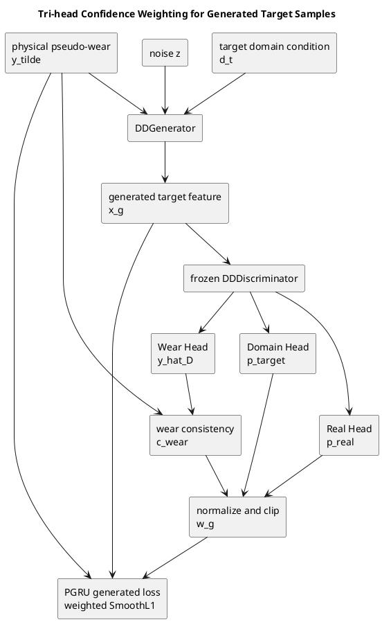

# C1->C4 快速改进方案：三头判别器置信度加权

**状态**：仅方案设计，尚未修改训练代码，尚未启动实验  
**日期**：2026-07-14  
**适用脚本**：`scripts/phm_proposed_pipeline.py`  
**主实验协议**：PHM 2010 full-lifecycle、单源无监督域适应、源域 C1 有真实 VB 标签、目标域 C4 训练时不可见真实 VB 标签

## 1. 问题锚点

当前 DDGAN 会为目标域生成带物理伪标签的特征，随后 PGRU 将所有生成样本以相同权重加入回归损失。这个设计默认每个生成样本都同样可信，但生成特征可能出现以下问题：

1. 特征不够真实，即 `Real/Fake Head` 不认可。
2. 特征仍偏向源域，即 `Domain Head` 不认可其目标域属性。
3. 特征与给定伪磨损条件不一致，即 `Wear Head` 的回归值与生成条件偏差较大。

因此，当前最小且最直接的改进不是增加一个新网络，而是复用已经训练好的三头判别器，对生成样本进行逐样本质量评估，并在 PGRU 的生成样本回归损失中降低低质量样本的影响。

**核心方法主张**：三头判别器不仅用于训练生成器，还可以作为生成样本的联合质量评估器；由真实性、目标域一致性和磨损条件一致性共同得到的置信度，可减少低质量伪样本对跨域磨损回归的负迁移。

**本轮非目标**：

- 不更换 DDGAN 或 PGRU 主干。
- 不同时叠加注意力、图网络、频域网络和新对齐模块。
- 不使用 C4 真实 VB 标签计算训练权重、调参或挑选 seed。
- 不追求一次性解决单调性、端点误差和所有迁移方向。

## 2. 文献依据与现有瓶颈

### 2.1 本地文献给出的启示

| 本地文献 | 主要机制或协议 | 对本方案的启示 | 与当前 C1->C4 的可比性限制 |
|---|---|---|---|
| *Cross-domain tool wear condition monitoring via residual attention hybrid adaptation network* | 通道注意力与全局/局部混合域适应，主要报告阶段分类准确率 | 注意力对跨域特征提取有效，但“添加注意力”本身已较常见，独立创新性有限 | 分类任务，不可直接与连续 VB 回归指标比较 |
| *DPPGAT: a graph neural network framework for reliable tool wear* | 图注意力建模；在 PHM 2010 上可使用两把源刀具测试第三把刀具 | 结构关系建模可以获得较高精度，但实现和协议成本更高 | C1+C6->C4 属于多源设置，不等价于单源 C1->C4 |
| *Frequency-aware and bionic-aligned collaborative modeling...* | 频率感知与仿生对齐，面向小样本跨工况监测 | 频域特征可能是后续方向，但会明显扩大方法和消融范围 | 数据集、量纲和迁移条件不同 |
| *Multi-task hierarchical domain adaptation multi-expert attention network...* | 分阶段/分层域适应与多专家注意力，同时考虑磨损和 RUL | 支持“磨损阶段不应等权处理”的判断；软阶段对齐具有后续价值 | 与 C1->C4 较接近，但其验证协议和图中数值需要谨慎核对 |
| *一种将机制-数据融合与转移学习相结合的机床数字孪生工具磨损预测模型* | 物理机理、迁移学习与 GPR 融合；目标域早期样本参与建模 | 说明物理先验有价值，也提醒必须区分无监督迁移和目标标签辅助迁移 | 使用目标域前段数据/标签时，不能作为纯 UDA 的直接对照 |
| *通过多源信号融合对刀具磨损进行可解释的 BiLSTM-KAN 建模* | 多源信号融合、注意力/可解释建模、监督式随机划分 | 可借鉴可解释性输出，但普通注意力和监督混合训练不构成当前协议下的直接优势 | C1、C4 混合后随机划分会让 C4 标签进入训练/验证 |
| 两篇本地学位论文 | 数字孪生、CNN-BiLSTM、MMD、多源域适应及特征学习 | 提供工程模块和相关工作背景 | 任务形式或监督条件与本实验不完全一致 |

从这些文献看，注意力、阶段对齐、频率感知和图建模都已有较充分先例。相比之下，当前代码已经具有 `Real/Domain/Wear` 三个互补判别头，却没有把它们用于生成样本筛选或加权。这是一个更贴近现有瓶颈、改动更小、也更容易形成完整机制解释的切入点。

> 注意：上述判断只基于当前本地文献集合，用于确定实验优先级；正式写作前仍需进行更大范围的查新，不能直接宣称“三头置信度加权首次用于刀具磨损迁移”。

### 2.2 当前三 seed 结果暴露的瓶颈

当前 full-lifecycle C1->C4 三 seed 的均值与样本标准差如下：

| 方法 | MAE (um) | RMSE (um) | R2 | Endpoint Error (um) | High-wear MAE (um) | Monotonic Violations | Pearson |
|---|---:|---:|---:|---:|---:|---:|---:|
| Source-only PGRU | 11.605 +/- 0.334 | 16.144 +/- 0.306 | 0.8188 +/- 0.0069 | 65.53 +/- 0.68 | 28.88 +/- 2.45 | 117.3 +/- 1.5 | 0.9462（约） |
| DANN-PGRU | 11.884 +/- 0.623 | 16.299 +/- 0.214 | 0.8153 +/- 0.0048 | 66.03 +/- 2.59 | 28.58 +/- 2.03 | 117.7 +/- 2.9 | 0.9470（约） |
| Proposed DDGAN-PGRU | 11.893 +/- 0.329 | 15.684 +/- 0.490 | 0.8289 +/- 0.0107 | 62.38 +/- 3.79 | 22.96 +/- 2.68 | 121.3 +/- 2.5 | 0.9499 +/- 0.0054 |
| Empirical time transfer | 13.222 | 15.510 | 0.8328 | 39.34 | 24.67 | 0 | 0.9562 |

结果说明：

- Proposed 在 RMSE、R2、端点误差和高磨损 MAE 上优于 Source-only，说明生成样本对严重误差和高磨损区间有帮助。
- Proposed 的平均 MAE 没有优于 Source-only，且 seed 间存在波动，说明部分生成样本可能造成了局部负迁移。
- Proposed 的单调违例没有改善，说明现有二阶平滑项和生成增强都没有直接约束磨损不可逆性。
- Empirical time transfer 在端点和单调性上仍强，说明后续需要专门处理生命周期顺序约束；但它不是学习式 UDA 方法的等价替代。

三头置信度加权首先针对第二点：保留高质量生成样本的高磨损增益，同时削弱低质量样本对平均误差和稳定性的影响。

## 3. 四种小改进的排序

| 综合优先级 | 改进项 | 预计代码改动 | 预计实现与自检成本 | 创新性潜力 | 直接针对的指标 | 主要风险 |
|---:|---|---:|---:|---|---|---|
| 1 | 三头判别器置信度加权 | 约 40-80 行 | 2-4 小时 | 中等偏高 | MAE、RMSE、高磨损 MAE、seed 稳定性 | 判别头未校准或权重塌缩 |
| 2 | 阶段感知单调损失 | 约 20-40 行 | 1-2 小时 | 中等偏低 | 单调违例、端点误差 | 过强约束会压平局部真实波动 |
| 3 | PGRU 注意力池化 | 约 20-30 行 | 2-4 小时 | 低到中等 | MAE、特征可解释性 | 普通注意力已有大量先例；特征坐标并非真实时间轴 |
| 4 | 物理引导软阶段对齐 | 约 80-150 行 | 0.5-1 天 | 中等偏高 | 高磨损 MAE、端点误差、跨阶段迁移 | 阶段边界和对齐权重引入更多超参数 |

按纯实现成本排序：阶段感知单调损失 < 注意力池化约等于三头置信度加权 < 物理引导软阶段对齐。  
按潜在方法创新性排序：三头置信度加权约等于物理引导软阶段对齐 > 阶段感知单调损失 > 普通注意力池化。  
按当前问题的综合收益/成本排序：三头置信度加权 > 阶段感知单调损失 > 注意力池化 > 物理引导软阶段对齐。

本轮只建议实施第一项。其余项必须在第一项的三 seed 结果出来后再决定，避免无法归因。

## 4. 三头判别器置信度加权

### 4.1 数据流



### 4.2 三个置信度分量

对第 `i` 个生成样本：

```math
x_i^g = G(z_i, \tilde{y}_i, d_t)
```

其中 `\tilde{y}_i` 是由物理模型或预设伪标签策略给出的磨损条件，`d_t` 是目标域条件。

**真实性置信度**：

```math
c_i^{real} = \sigma(D_{real}(x_i^g))
```

**目标域置信度**：

```math
c_i^{domain} = \operatorname{softmax}(D_{domain}(x_i^g))_{target}
```

**磨损条件一致性**：

```math
\delta_i = \frac{|D_{wear}(x_i^g)-\tilde{y}_i|}{s_y+\epsilon}
```

```math
c_i^{wear} = \exp\left(-\frac{\delta_i}{\tau}\right)
```

其中 `s_y` 用于消除归一化 VB 与原始 VB 量纲的差异：

- 归一化 VB 模式可令 `s_y = 1`。
- 原始 VB 模式使用源域标签的稳健范围 `s_y = Q_0.95(y_s)-Q_0.05(y_s)`。
- `epsilon` 仅用于数值稳定，建议固定为 `1e-8`。

三个分量的联合原始置信度为：

```math
q_i = c_i^{real} \cdot c_i^{domain} \cdot c_i^{wear}
```

乘积形式要求样本同时满足“像真实样本、像目标域样本、与磨损条件一致”。如果后续发现任一头校准过差，可在消融阶段测试几何平均或分量指数，但首版不增加这些自由度。

### 4.3 权重归一化与裁剪

为避免整个 batch 的生成损失因置信度整体偏低而消失，先按 batch 均值归一化，再裁剪：

```math
w_i = \operatorname{clip}\left(
\frac{q_i}{\frac{1}{B}\sum_{j=1}^{B}q_j+\epsilon},
w_{min}, w_{max}
\right)
```

首版建议：

```text
tau   = 0.10
w_min = 0.10
w_max = 2.00
```

归一化后平均权重接近 1，因此 `lambda_generated` 的总体量级保持可比；裁剪可以避免少量样本支配梯度，也保留低置信样本的少量训练信号。

### 4.4 加权生成回归损失

当前生成样本使用等权 SmoothL1。计划改为：

```math
\mathcal{L}_{gen}^{weighted} =
\frac{\sum_i w_i\,\operatorname{SmoothL1}(f_{PGRU}(x_i^g),\tilde{y}_i)}
{\sum_i w_i+\epsilon}
```

PGRU 总损失保持原有结构，仅替换生成样本项：

```math
\mathcal{L}_{PGRU} =
\mathcal{L}_{source-reg}
+ \lambda_{domain}\mathcal{L}_{domain}
+ \lambda_{generated}\mathcal{L}_{gen}^{weighted}
+ \lambda_{smooth}\mathcal{L}_{smooth}
```

首轮实验中 `lambda_smooth` 保持当前基线值，不同时启用新的单调损失。

### 4.5 训练边界

- 先按现有流程完成 DDGAN 训练，再计算生成样本置信度。
- 计算置信度时判别器设为 `eval()`，参数冻结，并对权重执行 `detach()`。
- 置信度不反向更新生成器或判别器；首版只改变 PGRU 对生成样本的使用方式。
- Source-only 与 DANN 分支保持不变。
- 推理阶段不需要判别器置信度，最终 C4 真实特征仍直接输入 PGRU。

## 5. 参数与输出文件设计

### 5.1 计划新增命令行参数

| 参数 | 类型/取值 | 默认值 | 作用 |
|---|---|---:|---|
| `--generated-weighting` | `none` / `tri_head` | `none` | 保持向后兼容；`none` 精确表示现有等权基线 |
| `--confidence-temperature` | float | `0.10` | 控制 Wear Head 偏差转为置信度的衰减速度 |
| `--confidence-min` | float | `0.10` | 生成样本权重下界 |
| `--confidence-max` | float | `2.00` | 生成样本权重上界 |

首版不增加分量系数、动态温度或可学习校准器。只有当诊断表明某一判别头明显失效时，才进入下一轮设计。

### 5.2 计划新增输出字段

现有 `{source}_to_{target}_generated_target_features.csv` 保留，并计划增加：

| 字段 | 含义 |
|---|---|
| `disc_p_real` | Real Head 给出的真实性概率 |
| `disc_p_target` | Domain Head 给出的目标域概率 |
| `disc_wear_pred` | Wear Head 对生成特征的磨损回归值 |
| `disc_wear_error_norm` | 与生成条件的无量纲绝对偏差 `delta_i` |
| `disc_wear_consistency` | `exp(-delta_i/tau)` |
| `generated_confidence_raw` | 三个置信度分量的乘积 `q_i` |
| `generated_weight` | batch 归一化并裁剪后的训练权重 `w_i` |

`proposed_pipeline_results.json` 计划在 `generation.confidence` 下增加：

- 三个分量、原始置信度和最终权重的 `mean/std/min/p05/p50/p95/max`。
- 权重落在下界和上界的比例。
- 有效样本量 `ESS = (sum w)^2 / sum(w^2)` 及其占生成样本数的比例。
- 当前 `generated_weighting`、温度和裁剪参数。

每个 seed 必须写入独立输出目录，禁止多个 seed 共用目录。三 seed 汇总阶段计划输出：

- `MULTI_SEED_SUMMARY.csv`
- `MULTI_SEED_SUMMARY.md`
- `MULTI_SEED_RESULTS.json`

这些均为后续实现设计，本次未创建，也未修改现有结果文件。

## 6. 三 seed 对照实验方案

### 6.1 固定实验条件

- 迁移方向：C1->C4。
- 数据范围：full-lifecycle。
- 标签量纲：真实全程 VB，保持当前 `--no-norm --pseudo-label-mode physical` 协议。
- 固定 seed：`20260510`、`20260511`、`20260512`。
- 特征提取、PCC 规则、网络宽度、GAN/PGRU epoch、学习率、生成样本数及所有损失系数保持一致。
- 每个 seed 的 baseline 与 tri-head 使用同一 seed，形成配对比较。

### 6.2 核心对照组

| 组别 | `generated_weighting` | 目的 |
|---|---|---|
| A：现有 Proposed | `none` | 等权生成样本基线 |
| B：Tri-head Proposed | `tri_head` | 验证联合置信度加权是否减少负迁移 |

Source-only PGRU、DANN-PGRU 和 empirical time transfer 继续作为背景基线报告，但核心因果比较是同一 seed 下 A 与 B 的差值。

### 6.3 指标与统计方式

主要指标：

- RMSE：检测大误差是否减少。
- High-wear MAE：检测高磨损区间是否保留或增强。
- MAE：防止只改善少量严重误差却损害整体样本。

次要指标：

- R2、Endpoint Error、Pearson、Monotonic Violations。
- 三个置信度分量、权重分布、裁剪比例和 ESS。

报告方式：

- 对每个方法报告三 seed 的 `mean +/- sample std`。
- 报告 B-A 的逐 seed 配对差值及平均相对变化。
- 三个 seed 不足以支撑强显著性结论，因此不以单个 p 值作为通过标准。
- 不选择 C4 测试指标最好的 seed 作为主结果。曲线图使用预先指定 seed，或使用最接近三 seed 均值的代表 seed，并明确选择规则。

### 6.4 最小消融

核心实验通过后，再以一个预先固定 seed 做诊断性消融：

1. `real only`
2. `domain only`
3. `wear only`
4. `real x domain x wear`

该消融用于判断性能来自联合质量判断还是某一个头。若核心三 seed 实验不通过，则先检查判别头校准和权重分布，不直接扩展完整消融。

## 7. 成功标准

### 7.1 工程通过标准

同时满足以下条件，视为值得保留：

1. Tri-head 相对现有 Proposed 的平均 RMSE 至少下降 3%。
2. 三个 seed 中至少两个 seed 的 RMSE 改善。
3. 平均 High-wear MAE 不变差；理想目标为下降至少 3%。
4. 平均 MAE 的退化不超过 1% 或 0.2 um，取更严格者。
5. Endpoint Error 不出现超过 3% 的系统性退化。
6. 权重没有塌缩：上下界裁剪比例均低于 10%，ESS 比例建议高于 50%。

### 7.2 论文级积极证据

在工程标准之外，若出现以下证据，可支持更强的方法叙事：

- 三个 seed 的 RMSE 均改善，且 High-wear MAE 平均下降至少 5%。
- 低置信度组表现出更大的 Wear Head 条件偏差或更不稳定的生成特征，说明置信度具有可解释的质量排序能力。
- 联合三头优于任意单头消融，证明三个分量具有互补性。
- 改进不依赖 C4 标签调参，并能在 C4->C6 或其他方向复现相同趋势。

未达到这些条件时，只能报告为工程性加权策略，不能夸大为稳定、普适的跨域改进。

## 8. 标签泄漏防护

### 8.1 允许进入训练的信息

- C1 真实传感器特征和真实 VB 标签。
- C4 无标签传感器特征。
- 刀具编号/域标识。
- 不依赖 C4 真实 VB 的物理伪标签或预先固定的生命周期进度先验。
- DDGAN 三头对生成特征产生的输出。

### 8.2 禁止进入训练、调参和 seed 选择的信息

- C4 任意 cut 的真实 VB。
- 由 C4 真实 VB 拟合的归一化上下界、阶段边界、温度、损失权重或物理曲线参数。
- C4 的 MAE/RMSE/R2/Endpoint Error 用于选择超参数、early stopping 或挑选最佳 seed。
- 先查看 C4 测试结果，再决定报告哪些 seed。

### 8.3 操作约束

- `confidence-temperature/min/max` 在三 seed 运行前冻结。
- 如需调参，只能使用源域内部训练/验证划分，或在与最终 C1->C4 独立的预实验迁移方向上完成。
- C4 真实标签只在所有模型训练完成后用于统一离线评估。
- 结果表必须保留所有预注册 seed，包括失败 seed。
- 生成样本置信度必须由冻结判别器输出，不可用目标真实误差反向校准。

## 9. 后续候选项

### 9.1 阶段感知单调损失

当前 `smoothness_loss` 约束二阶差分，但不会直接惩罚预测磨损下降。后续可增加：

```math
\mathcal{L}_{mono} = \frac{1}{T-1}\sum_{t=1}^{T-1}
\alpha_t\operatorname{ReLU}(\hat{y}_t-\hat{y}_{t+1}+m)
```

其中 `alpha_t` 可依据无标签生命周期进度或物理伪阶段设置，高磨损阶段权重更大。首版建议 `m=0`，并单独加入 `lambda_mono`。该项直接针对 121 次左右的单调违例，但必须验证是否造成曲线过度平滑和 MAE 上升。

启用条件：三头加权已经改善 RMSE/高磨损 MAE，但单调违例和端点误差仍无改善。

### 9.2 PGRU 注意力池化

当前 PGRU 对所有特征坐标的双向 GRU 输出做均值池化。可改为：

```math
a_j = \operatorname{softmax}_j(v^T\tanh(Wh_j))
```

```math
\bar{h} = \sum_j a_j h_j
```

注意力权重可用于分析不同力、振动和声发射特征的贡献。需要注意：这里的序列位置是“特征坐标”，不是切削时间，因此注意力只能解释特征选择，不能被表述为生命周期时序注意力；同时必须固定特征排序，避免跨运行含义变化。

启用条件：三头加权稳定有效后，确实需要提高特征聚合能力或补充可解释性。普通注意力已有充分先例，不建议作为论文唯一创新点。

### 9.3 物理引导软阶段对齐

若后续需要更强的方法贡献，可由物理伪磨损得到 initial/stable/rapid 三阶段的软隶属度，并在源域与目标域之间执行阶段加权的均值对齐或 MMD。它比硬阶段切分更能容忍不同刀具的转折点偏移，但实现和调参成本高于本轮方案。

启用条件：三头加权只能改善生成样本质量，却无法解决跨阶段分布错位；并且已有至少两个迁移方向支持该问题判断。

## 10. 实施顺序与停止条件

1. 实现 `generated-weighting=none|tri_head`，确认 `none` 与当前结果在允许的数值误差内一致。
2. 检查三个判别头的输出范围、权重分布、裁剪比例和 ESS。
3. 运行 C1->C4 三 seed 配对实验，只比较等权与三头加权。
4. 达到工程通过标准后，再做单头消融，并复验 C4->C6。
5. 若单调性仍差，再单独加入阶段感知单调损失。
6. 注意力池化和软阶段对齐暂不实施，除非前述结果明确暴露相应瓶颈。

停止条件：如果三头加权在三个 seed 中少于两个改善 RMSE，或权重长期塌缩到裁剪边界，则停止扩展实验，优先检查判别头校准、Wear Head 的量纲和生成数据分布，而不是继续叠加模块。

## 11. 预期贡献边界

若实验通过，可谨慎表述为：

> 提出一种判别器复用的生成样本质量加权策略，联合利用真实性、目标域一致性与磨损条件一致性，抑制无监督跨刀具磨损回归中的低质量伪样本负迁移。

不能仅凭 C1->C4 三 seed 声称：

- 达到 PHM 2010 最先进性能。
- 对所有刀具和工况普适。
- 优于使用目标域真实标签训练的监督或半监督方法。
- 三头置信度具有严格概率校准意义。

最终论文比较必须按监督条件分组：纯 UDA、目标标签辅助迁移、多源监督和混合随机划分不能放在同一排行榜中直接定胜负。
